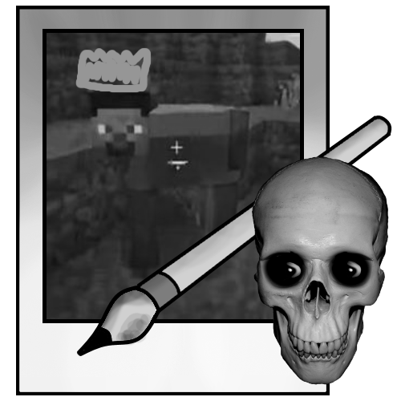
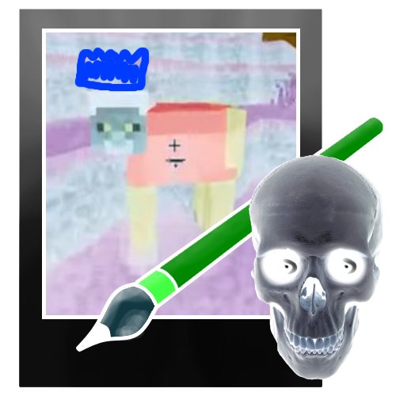
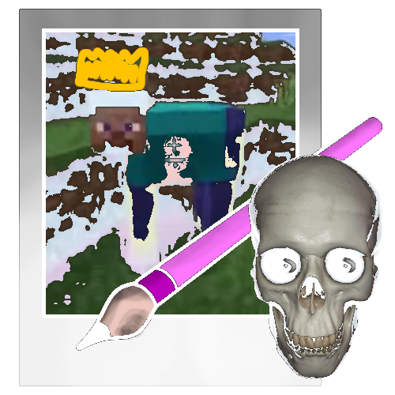
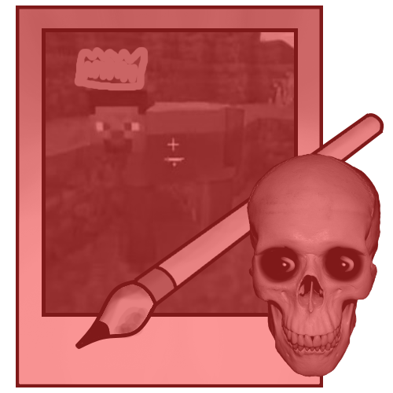
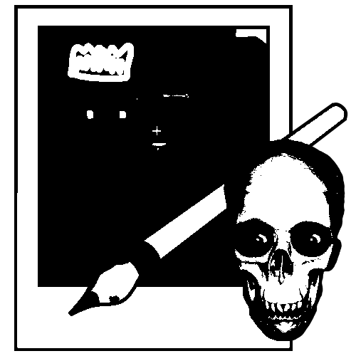
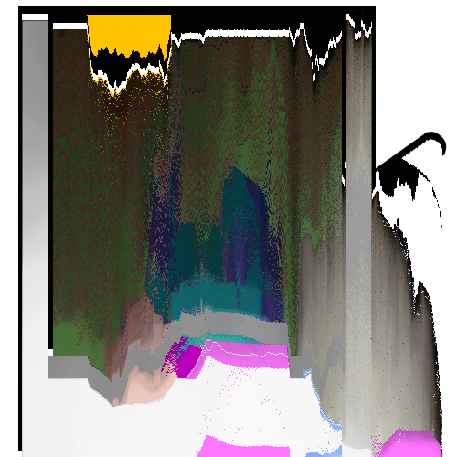
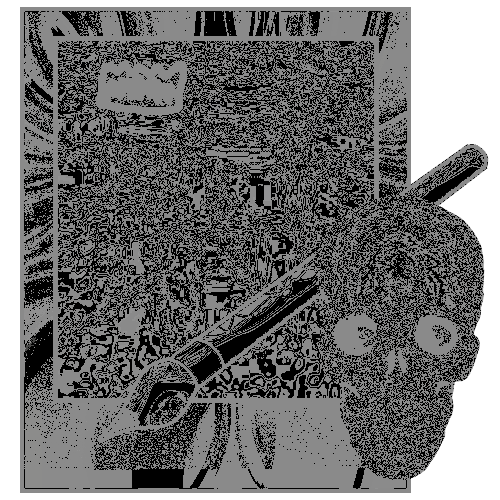
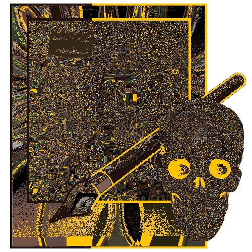

# paint.rip

A simple Java application to manipulate images in a variety of ways.

## Features

- Open, Save and Resize images
- Flip Images

### Effects

##### Grayscale

Converts the image to grayscale.

Possible options:
- Treshold (0-256) - The value at which the image is converted to black and white.

##### Invert

Inverts the colors of the image.

Possible options:
- Treshold (0-256) - The value at which the image is going to be inverted.

##### Invert with Treshold

Inverts the colors of the image with a treshold of 100.

##### Melt

Melt a color into the image.
In the example below, the red color is melted into the image.

Possible options:
- Color - The color to melt into the image.
- Treshold (0-256) - The value at which the image is going to be melted.

##### Black and White

Distorts the image to black and white.

Possible options:
- Treshold (0-256) - The value at which the image is converted to black and white.

##### Row Slicer

Fully distorts the image by sorting the rows of the image.

Possible options:
- RowSlicerMode - The mode of the row slicer. (RED, GREEN, BLUE)

##### Cos Sin Shuffler (Low Modulo Settings)

Shuffles the image by using the cos and sin functions.

Possible options:
- Modulo - The modulo of the cos and sin functions.

##### Cos Sin Shuffler (High Modulo Settings)

